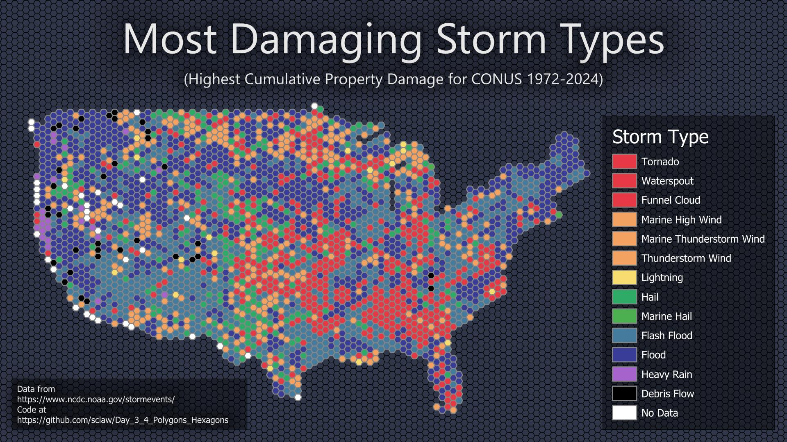

Code supporting days 5 and 6 of the 30DayMapChallenge 2024.

This repository downloads data from the NOAA Storm Events Database and aggregates property damages across years within user-defined spatial areas.

